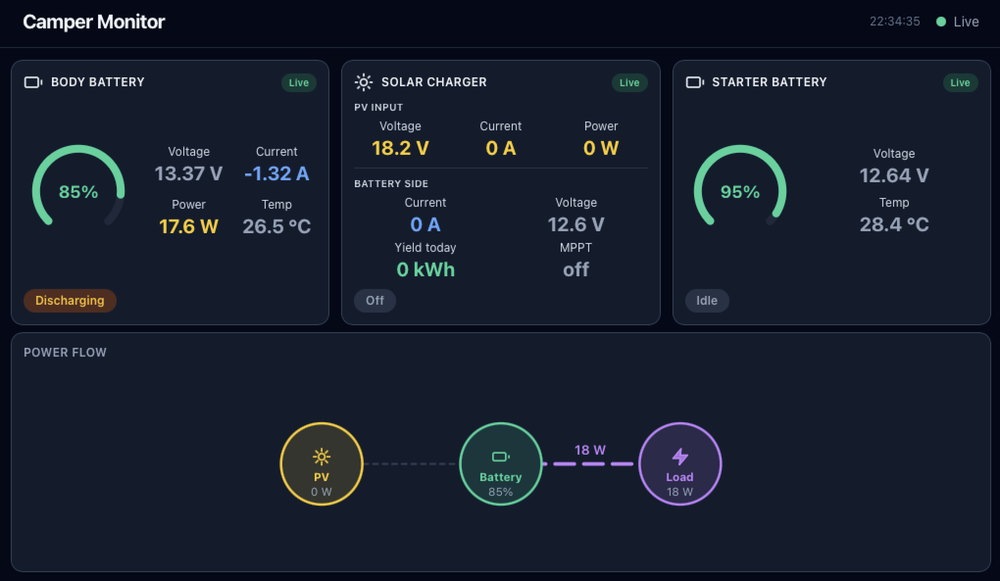

# Camper Monitor

Real-time dashboard for a 12V LiFePO4 camper battery and Victron SmartSolar MPPT 75/15, running on a Raspberry Pi Zero with an attached 1024×600 display.



## What it shows

**Body Battery — (Eco-Worthy LiFePO4, ECO AA-frame BMS via Bluetooth)**
- State of Charge with animated gauge
- Voltage, current, power
- Status: Charging / Discharging / Idle
- Temperature

**Solar Charger (Victron SmartSolar 75/15 via VE.Direct or Bluetooth)**
- PV voltage, current, power (voltage and current not available via BLE)
- Battery-side current and voltage
- Charge mode: Bulk / Absorption / Float / Off / …
- MPPT mode (VE.Direct only)
- Yield today (kWh)
- Animated power flow diagram

**Starter Battery — (intAct Battery-Guard / BM6, optional)**
- Voltage
- State of Charge
- Temperature
- Status: Charging / Idle

---

## Local development on MAC (no hardware)

Requires **Node.js 20+**. Install it from [nodejs.org](https://nodejs.org) or via your package manager:

```sh
# macOS (Homebrew)
brew install node

# Debian / Ubuntu — apt splits Node and npm, install both explicitly:
sudo apt-get update
sudo apt-get install -y nodejs npm
```

Then clone and run:

```sh
git clone https://github.com/its-really-me/camper-monitor.git
cd camper-monitor
npm install
npm install --prefix packages/ui   # Vite and React dev deps (not in root workspace)
npm run dev
```

Open **http://localhost:5173** — mock data runs automatically, no devices needed.

> If Vite picks a different port it prints the URL in the terminal.

> If you ever run a bare `npm install` at the root again (e.g. after pulling new packages), re-run `npm install --prefix packages/ui` afterwards — the root install does not cover `packages/ui` since it is built separately for the Pi.

---

## Raspberry Pi installation

### Hardware

| Board | Display path | Notes |
|---|---|---|
| Pi Zero W | Framebuffer renderer (`ui-fb`) | ARMv6 — browsers require NEON (ARMv7+) and crash |
| Pi Zero 2 W | Firefox ESR kiosk | ARMv8 — full NEON support; Firefox ESR has no low-memory warning |

OS: Raspberry Pi OS Bookworm or Debian Trixie (tested on Trixie)  
Display: HDMI at 1024×600 (confirmed hardware resolution)

### 1 — Flash and first boot

Flash Raspberry Pi OS Bookworm (64-bit, Lite) or Debian Trixie with Raspberry Pi Imager. Enable SSH and Wi-Fi in the imager settings before writing so you can log in headlessly.

### 2 — SSH in

```sh
ssh pi@<your-pi-ip>
```

### 3 — Clone and run the installer

```sh
git clone https://github.com/its-really-me/camper-monitor.git ~/camper-monitor
sudo bash ~/camper-monitor/scripts/install.sh
```

The installer works in the cloned directory (does not copy to `/opt`).

The installer will:
- Install Node.js 20 (via NodeSource)
- Set boot target to CLI and enable SSH
- Create a 512 MB swap file (if none exists — `dphys-swapfile` is unavailable on Trixie)
- Install Bluetooth, serial port, and X11 / Firefox ESR dependencies
- Auto-detect your Pi model and set up the framebuffer renderer (Pi Zero W) or **Firefox ESR** kiosk (Pi Zero 2 W)
- Run `npm install` (native modules compiled after configuration)
- Launch the **configuration wizard** (see below)
- Build the React UI (Pi Zero 2 W only, after wizard)

> **Alternative — no clone needed:**
> ```sh
> curl -fsSL https://raw.githubusercontent.com/its-really-me/camper-monitor/main/scripts/install.sh | sudo bash
> ```
> The script clones the repo itself if it isn't already there.

### 4 — Configuration wizard

The wizard runs automatically at the end of the installer. It can also be re-run at any time:

```sh
sudo bash /opt/camper-monitor/scripts/configure.sh
```

It will ask for:
- Battery driver (`ble` / `mock`) and BLE MAC address; if `ble`: BMS protocol (`jbd` for standard JBD/Daly-OEM BMS or `eco` for Eco-Worthy AA-frame variant)
- Solar driver (`vedirect` / `ble` / `mock`), serial port or BLE MAC + advertisement key
- **Starter battery** (optional) — `y/N`; if yes: BLE MAC address (BM6 encryption key is static, no entry needed)
- HTTP server port
- **Pi Zero W only:** touch device path
- Screen-blank idle timeout in minutes — both Pi Zero W and Pi Zero 2 W (`0` to disable)

It writes `settings.yaml`, `.env`, systemd service files (and `~/.xinitrc` on Pi Zero 2 W), then enables them.

> **Web-based setup alternative:** If `settings.yaml` is missing, the server automatically serves a setup form at `http://<pi-ip>:3000/setup`. Fill it in from any browser on the local network — no SSH required. The server writes the config and restarts into the dashboard automatically. The form is also accessible at `/setup` at any time to reconfigure.

### 5 — Reboot and verify

```sh
sudo reboot
```

After reboot the dashboard should appear on the display automatically. If something is wrong:

```sh
sudo journalctl -u camper-monitor -f   # server logs
sudo journalctl -u ui-fb -f            # Pi Zero W — framebuffer renderer logs
sudo journalctl -u kiosk -f            # Pi Zero 2 W — Firefox ESR kiosk logs
```

---

## Victron SmartSolar via Bluetooth

The SmartSolar 75/15 broadcasts live data over BLE using encrypted advertisements (Victron *Instant Readout*). No USB cable is needed, but the available data is slightly reduced compared to VE.Direct — see the comparison table below.

### Data available per transport

| Field | VE.Direct (USB) | Bluetooth |
|---|:---:|:---:|
| PV voltage | ✅ | ❌ |
| PV current (derived) | ✅ | ❌ |
| PV power | ✅ | ✅ |
| Battery current | ✅ | ✅ |
| Battery voltage | ✅ | ✅ |
| Charge mode | ✅ | ✅ |
| MPPT mode | ✅ | ❌ |
| Yield today | ✅ | ✅ |

> PV voltage is not included in the BLE advertisement payload. If you need it, use VE.Direct.

### Step 1 — Get the advertisement key

The SmartSolar encrypts its BLE broadcasts with a per-device 128-bit key. Retrieve it from the **VictronConnect** app:

1. Open VictronConnect and connect to your SmartSolar.
2. Tap the device name at the top → **Product info**.
3. Scroll down to **Advertisement key** — copy the 32-character hex string (e.g. `a1b2c3d4e5f6...`).

> The key never changes unless you reset the device. Store it somewhere safe.

### Step 2 — Find the MAC address

On the Pi (or any Linux machine with BlueZ):

```sh
sudo bluetoothctl
> scan on
# The SmartSolar appears as "SmartSolar MPPT 75|15" or similar
> scan off
> quit
```

On macOS the Bluetooth address is shown as a UUID in `bluetoothctl` alternatives; use the VictronConnect device list to confirm.

### Step 3 — Configure `settings.yaml`

```yaml
readers:
  solar:
    driver: ble
    macAddress: "AA:BB:CC:DD:EE:FF"   # SmartSolar BLE MAC
    advertisementKey: "a1b2c3d4e5f6778899aabbccddeeff00"  # 32-char hex from VictronConnect
    pollInterval: 10000   # UI staleness check interval; ads arrive ~every 1-2 s passively
```

Leave `macAddress` empty to accept the first Victron Instant Readout advertisement seen — useful when the device MAC is unknown or uses a rotating private address:

```yaml
    macAddress: ""   # blank = accept any Victron SmartSolar
```

### BLE advertisement format (technical reference)

The SmartSolar broadcasts **Instant Readout** advertisements with Victron company ID `0x02E1`. The reader is passive — no connection is established.

| Byte(s) | Content |
|---------|---------|
| mfr[0:1] | Company ID `0x02E1` (LE) |
| mfr[2] | Record marker `0x10` |
| mfr[6] | Record type `0x01` = solar charger |
| mfr[7:8] | IV: LE uint16, zero-padded to 16 bytes |
| mfr[9] | `key[0]` — transmitted unencrypted; use to verify the advertisement key before decrypting |
| mfr[10:] | 12-byte AES-128-CTR ciphertext |

Decrypted payload fields: charge state (CS) at byte 0, battery voltage at bytes 2–3 (10 mV resolution), battery current at bytes 4–5 (100 mA), yield today at bytes 6–7 (10 Wh → kWh), PV power at bytes 8–9 (W).

PV voltage and PV current are **not** present in the BLE advertisement. The UI hides these fields automatically when using the BLE driver.

> **Spec:** Victron "Extra Manufacturer Data" document, 2022-12-14.

### BLE staleness thresholds

In a busy BLE environment (many nearby devices), the Pi may receive only 1 advertisement every 1–2 minutes. The UI uses 120 s as the poll interval for the solar card:

| Threshold | Time |
|-----------|------|
| Warn (grey age label appears) | 4 min (2 × 120 s) |
| Overlay (stale reading shown with overlay) | 10 min (5 × 120 s) |

The last known reading remains visible at all times; the overlay appears on top of it only after 10 minutes without a new advertisement.

### Step 4 — Enable Bluetooth on the Pi (if not already done)

```sh
sudo apt install -y bluetooth bluez
sudo systemctl enable --now bluetooth
sudo setcap cap_net_raw+eip $(which node)   # allow Node.js to scan BLE without root
```

### Switching between Bluetooth and VE.Direct

Change the `driver` value in `settings.yaml` — no code changes needed:

```yaml
# Bluetooth (no cable, reduced data)
solar:
  driver: ble

# VE.Direct USB cable (full data including PV voltage)
solar:
  driver: vedirect
  port: /dev/ttyUSB0
```

Or override at runtime without editing the file:

```sh
SOLAR_DRIVER=ble npm start
SOLAR_DRIVER=vedirect npm start
```

---

## Finding MAC addresses

### ECO BMS (body battery)

On the Pi (or any Linux machine with BlueZ):

```sh
sudo bluetoothctl
> scan on
# wait ~10 s — the BMS will appear; Eco-Worthy AA-frame BMS advertises as "ECOB<last4hex>" (e.g. ECOB481)
> scan off
> quit
```

Copy the `AA:BB:CC:DD:EE:FF` address into `settings.yaml → readers.battery.macAddress`.

### Victron SmartSolar (BLE driver only)

See the [Victron SmartSolar via Bluetooth](#victron-smartsolar-via-bluetooth) section above for the full setup guide including how to retrieve the advertisement key and MAC address.

---

## Display: Pi Zero W vs Pi Zero 2 W

| Board | Approach | Why |
|---|---|---|
| Pi Zero W (ARMv6) | **Framebuffer renderer** (`ui-fb`) | No browser — browsers require NEON (ARMv7+) |
| Pi Zero 2 W (ARMv8) | **Firefox ESR kiosk** | Full NEON support; Firefox ESR has no low-memory warning on 512 MB RAM |

The install script detects the architecture automatically and sets up the right path.

### Pi Zero W — framebuffer renderer

`packages/ui-fb` is a Node.js process that connects to the server's SSE stream and draws the dashboard directly to `/dev/fb0` using `node-canvas` (Cairo). No X11, no browser, no NEON required.

> **Boot to CLI required.** If a desktop environment is installed, X11 will claim the framebuffer on boot and `ui-fb` won't be able to render. Set the Pi to boot to console:
> ```sh
> sudo raspi-config
> ```
> → System Options → Boot / Auto Login → **Console** (or Console Autologin).  
> Reboot after changing this setting.

The `canvas` npm package compiles from source on ARMv6 — this takes **5–15 minutes** on Pi Zero W hardware. The install script handles this automatically.

### Screen blanking (Pi Zero W)

`ui-fb` can blank the display after a period of inactivity and unblank it on touch. The `configure.sh` wizard asks for both values:

| Env var | Default | Description |
|---|---|---|
| `TOUCH_DEVICE` | `/dev/input/event0` | Path to the touch input device |
| `BLANK_TIMEOUT` | `3` | Idle minutes before blanking; `0` to disable |

To find your touch device path:
```sh
cat /proc/bus/input/devices | grep -A5 -i touch
# look for "event<N>" under the touchscreen entry
```

Blanking writes to `/sys/class/graphics/fb0/blank`, which requires root. `configure.sh` adds a targeted sudoers rule automatically:
```
camper ALL=(root) NOPASSWD: /usr/bin/tee /sys/class/graphics/fb0/blank
```

If you skip `configure.sh` and need to add this manually:
```sh
echo "camper ALL=(root) NOPASSWD: /usr/bin/tee /sys/class/graphics/fb0/blank" | sudo tee /etc/sudoers.d/camper-monitor-blank
sudo chmod 440 /etc/sudoers.d/camper-monitor-blank
```

System dependencies installed automatically by `scripts/install.sh`:
```sh
sudo apt install -y libcairo2-dev libpango1.0-dev libjpeg-dev libgif-dev \
                   build-essential pkg-config fonts-dejavu-core
```

The `ui-fb` process runs as a systemd service:
```sh
sudo systemctl status ui-fb
sudo journalctl -u ui-fb -f
```

### Pi Zero 2 W — Firefox ESR kiosk

Standard X11 + Firefox ESR setup. The install script installs Firefox ESR and writes `~/.xinitrc` and a `kiosk.service` automatically.

> **Chromium** was evaluated but shows a non-suppressible "less than 1 GB RAM" warning on Pi Zero 2 W (512 MB physical RAM). Firefox ESR has no such check.

The kiosk launches on VT7 (`-- vt7`) so it doesn't conflict with the getty login prompt on VT1. The `kiosk.service` uses `TTYPath=/dev/tty7`, `PAMName=login`, and `WantedBy=multi-user.target`.

### Screen blanking (Pi Zero 2 W)

`configure.sh` writes DPMS blanking commands into `~/.xinitrc` via `xset`. The wizard prompts for the idle timeout (minutes; `0` to disable), matching the Pi Zero W behaviour.

Example `~/.xinitrc` for a 3-minute blank:

```sh
xset s 180 180
xset dpms 0 0 180
openbox &
sleep 2
mkdir -p /tmp/firefox-kiosk
firefox-esr --kiosk --no-remote --profile /tmp/firefox-kiosk http://localhost:3000
```

No sudoers rule is needed — DPMS is handled entirely within X11. The Firefox profile is stored on tmpfs (`/tmp`) so it starts fresh after each reboot.

---

## Hardware wiring

### ECO BMS → Pi Zero

No wiring needed — Bluetooth is wireless. Ensure the BMS is powered and within ~10 m of the Pi.

### Victron SmartSolar → Pi Zero (VE.Direct)

You need a **VE.Direct to USB** cable (Victron part ASS030530010, ~€15).

```
SmartSolar VE.Direct port  →  USB cable  →  Pi Zero USB port
```

The cable appears as `/dev/ttyUSB0`. If you have other USB serial devices, check with:

```sh
ls /dev/ttyUSB*
dmesg | grep tty
```

---

## Troubleshooting

### Data not showing on the display

Cards show a status overlay — **Scanning…**, **Disconnected**, or **No data** — when readings are unavailable. To dig deeper over SSH:

```sh
# Live server logs — connection events + 60-second diagnostic summaries
journalctl -u camper-monitor -f

# Full diagnostic snapshot for both readers
curl -s localhost:3000/diagnostics | python3 -m json.tool
```

### BLE not connecting (`nobleState: poweredOff`)

The Bluetooth adapter exists but is not powered on.

```sh
# Check adapter state
hciconfig

# Unblock and bring up manually
sudo rfkill unblock bluetooth
sudo hciconfig hci0 up

# Permanent fix — should be set by configure.sh, but if missing:
sudo sed -i 's/#AutoEnable=true/AutoEnable=true/' /etc/bluetooth/main.conf
sudo systemctl restart bluetooth
```

### BLE scanning but device not found

Check what addresses are actually visible during the scan:

```sh
# Devices seen by the battery reader
curl -s localhost:3000/diagnostics | python3 -c \
  "import sys,json; [print(x) for x in json.load(sys.stdin)['battery']['devicesSeenInScan']]"

# Devices seen by the solar reader
curl -s localhost:3000/diagnostics | python3 -c \
  "import sys,json; [print(x) for x in json.load(sys.stdin)['solar']['recentDevices']]"
```

If the target device appears but with a different MAC than configured, re-run `sudo bash scripts/configure.sh` to update `settings.yaml`.

### Solar BLE — no Victron advertisements (`victron=0`)

`adv=N victron=0` means N advertisements were received but none matched the Victron company ID. Causes:

- Solar charger is off or out of BLE range (~10 m)
- Wrong MAC configured — run the scan check above
- `adv=0` — BLE adapter not scanning (check `nobleState` first)

### Starter battery slow to connect or never connects

Check the diagnostics snapshot — look at `starter.connectAttempts`, `starter.devicesSeenInScan`, and `starter.secondsSinceReading`:

```sh
curl -s localhost:3000/diagnostics | python3 -m json.tool
```

- `devicesSeenInScan` empty after 30 s → BM6 not advertising; check it with the vendor app
- BM6 in scan list but `connectAttempts` stays at 0 → restart the service

Root cause and fix: see [Bug-8 in Bug-fixes.md](Bug-fixes.md#bug-8).

### Battery BMS reads once then stops

On Pi Zero, BlueZ silently stops emitting BLE discover events after an L2 connection failure. Symptom: `connectAttempts: 1`, `connectedAt: <time>`, then no further reads. A watchdog kicks in every 60 s to force a BLE stop+start cycle. Check `consecutiveHangs` in the diagnostics — exponential backoff is applied: 5 s / 30 s / 60 s / 120 s per consecutive hang.

```sh
curl -s localhost:3000/diagnostics | python3 -c \
  "import sys,json; d=json.load(sys.stdin)['battery']; print('hangs:', d.get('consecutiveHangs'), 'last error:', d.get('lastConnectError'))"
```

The BMS often stops advertising for 2–5 minutes after a failed connection attempt. This is normal — the watchdog will reconnect automatically.

### Solar BLE — decryption not working / `readingsTotal: 0`

If `solarChargerPassed > 0` but `readingsTotal` stays 0, the advertisement key may be wrong or the diagnostic captures may be from a stale sample.

Run `solar-test.js` to test all decryption variants against fresh samples:

1. Get fresh `mfrHex` values from the diagnostics:
   ```sh
   curl -s localhost:3000/diagnostics | python3 -c \
     "import sys,json; d=json.load(sys.stdin)['solar']; print(d.get('lastMacMatch',{}).get('mfrHex'))"
   ```
2. Paste the hex into the `SAMPLES` array in `solar-test.js`.
3. Run from the repo root:
   ```sh
   node solar-test.js
   ```
4. Any `*** HIT` line with a plausible battery voltage (11–16.5 V) identifies the working parameters.
5. If `mfr[9]` does not match `key[0]`, the advertisement key in `settings.yaml` is wrong — retrieve the correct key from VictronConnect → device → Product info → Advertisement key.

If there are no hits at all, the advertisement key is wrong or the samples are from a different device.

### Service restart not reliable

A full reboot is more reliable than `systemctl restart` when the BLE stack is involved:

```sh
sudo reboot
```

### Deploying updates

After pulling new code, rsync it to the install directory and restart both services. On the Pi Zero 2 W, the kiosk must be restarted too — Firefox holds the old JS bundle in memory until the page reloads, and restarting `camper-monitor` alone does not trigger a reload:

```sh
cd ~/camper-monitor && git pull && \
  sudo rsync -a --exclude=node_modules --exclude=settings.yaml \
    ~/camper-monitor/ /opt/camper-monitor/ && \
  sudo systemctl restart camper-monitor kiosk
```

The UI bundle (`packages/ui/dist/`) is pre-built and committed to git, so translation changes and other UI updates are included automatically — no rebuild step needed on the Pi.

If `package.json` changed (new npm dependencies), also run after rsync:

```sh
cd /opt/camper-monitor && sudo -u camper npm install \
  --workspace=packages/server \
  --workspace=packages/reader-battery \
  --workspace=packages/reader-solar \
  --workspace=packages/reader-starter \
  --omit=optional --loglevel=error
```

On the Pi Zero W (framebuffer renderer), replace `kiosk` with `ui-fb`.

### Ctrl+Alt+F1 / VT switching doesn't work

Symptom: `sudo chvt 1` hangs, keyboard shortcut blinks the cursor once but doesn't switch. Diagnose with:

```sh
loginctl session-status   # kiosk session should appear; if only SSH is listed, see Bug-10
```

Workaround (always works): stop X over SSH to release the display, then switch freely:

```sh
sudo systemctl stop kiosk   # drops to console
sudo systemctl start kiosk  # back to kiosk
```

Root cause and fix: see [Bug-10 in Bug-fixes.md](Bug-fixes.md#bug-10).

### `kiosk` restart times out

`configure.sh` sets `TimeoutStopSec=10` automatically. See [Bug-9 in Bug-fixes.md](Bug-fixes.md#bug-9) for the manual one-liner.

---

## Configuration reference

| Setting | Where | Description |
|---|---|---|
| `readers.battery.driver` | `settings.yaml` | `ble` or `mock` |
| `readers.battery.macAddress` | `settings.yaml` | BLE MAC of ECO AA-frame BMS |
| `readers.battery.pollInterval` | `settings.yaml` | Active BLE poll interval in ms (default 15000) |
| `readers.solar.driver` | `settings.yaml` | `vedirect`, `ble`, or `mock` |
| `readers.solar.port` | `settings.yaml` | Serial port for VE.Direct (default `/dev/ttyUSB0`) |
| `readers.solar.macAddress` | `settings.yaml` | BLE MAC of SmartSolar (BLE driver only) |
| `readers.solar.advertisementKey` | `settings.yaml` | 32-char hex key (BLE driver only); retrieve from VictronConnect → Product info |
| `readers.solar.pollInterval` | `settings.yaml` | Staleness check interval in ms (default 10000; UI uses 120000 for BLE) |
| `readers.starter.driver` | `settings.yaml` | `bm6` or `mock` — omit entire `starter:` block to disable |
| `readers.starter.macAddress` | `settings.yaml` | BLE MAC of intAct Battery-Guard / BM6 device |
| `readers.starter.pollInterval` | `settings.yaml` | Active BLE poll interval in ms (default 30000) |
| `server.port` | `settings.yaml` | HTTP port (default 3000) |
| `BATTERY_DRIVER` | `.env` | Overrides `readers.battery.driver` |
| `SOLAR_DRIVER` | `.env` | Overrides `readers.solar.driver` |
| `SOLAR_PORT` | `.env` | Overrides `readers.solar.port` |
| `STARTER_DRIVER` | `.env` | Overrides `readers.starter.driver` |
| `PORT` | `.env` | Overrides `server.port` |

---

## Scripts

```sh
npm run dev        # development: mock data + Vite HMR
npm start          # production: reads hardware, serves built UI
npm run build:ui   # build React UI into packages/ui/dist/
```

---

## Adding a new reader

Each reader is a package that exports `createReader(config)` returning `{ start(), stop(), events }`. Events emitted: `data`, `connected`, `disconnected`, `error`.

1. Create `packages/reader-<name>/`
2. Implement the interface (copy `packages/reader-battery/src/mock.js` as a template)
3. Register the driver key in the relevant `packages/reader-*/src/index.js`
4. Set the driver in `settings.yaml`

No changes to the server or UI are needed.

---

## Acknowledgements

The BLE protocol work in this project stands on the shoulders of others who documented or reverse-engineered these proprietary protocols:

- **[Victron Energy](https://www.victronenergy.com)** — published the [Extra Manufacturer Data specification](https://communityarchive.victronenergy.com/storage/attachments/extra-manufacturer-data-2022-12-14.pdf) (2022-12-14) covering the Instant Readout BLE advertisement format for SmartSolar and other Victron devices. The AES-128-CTR encryption scheme, IV layout, and field offsets used in `reader-solar` are all taken directly from that document.

- **[tarball.ca](https://tarball.ca/posts/reverse-engineering-the-bm6-ble-battery-monitor/)** — reverse-engineered the BM6 BLE battery monitor protocol, including the GATT service/characteristic layout, AES-128-CBC decryption with static key, and handshake sequence. The `reader-starter` implementation is based entirely on that work.

- **[mike805/eco-worthy-battery-logger](https://github.com/mike805/eco-worthy-battery-logger/issues/3)** — documented the ECO AA-frame BMS protocol (0xAA/0x55 framing, command set, and LE uint16 cell voltage encoding) through issue discussion and experimentation. That thread was essential for getting cell voltages right in `reader-battery`.

---

---

# Camper Monitor — Deutsche Übersetzung

Echtzeit-Dashboard für eine 12-V-LiFePO4-Aufbaubatterie und den Victron SmartSolar MPPT 75/15, betrieben auf einem Raspberry Pi Zero mit angeschlossenem 1024×600-Display.

## Was angezeigt wird

**Bordbatterie (Eco-Worthy LiFePO4, ECO AA-frame-BMS via Bluetooth)**
- Ladezustand mit animiertem Rundinstrument
- Spannung, Strom, Leistung
- Status: Laden / Entladen / Standby
- Temperatur

**Solarladeregler (Victron SmartSolar 75/15 via VE.Direct oder Bluetooth)**
- PV-Spannung, -Strom, -Leistung (Spannung und Strom nicht via BLE verfügbar)
- Batteriestrom und -spannung (Ausgangsseite)
- Lademodus: Bulk / Absorption / Erhaltung / Aus / …
- MPPT-Modus (nur VE.Direct)
- Ertrag heute (kWh)
- Animiertes Leistungsflussdiagramm

**Starterbatterie (intAct Battery-Guard / BM6, optional)**
- Spannung
- Ladezustand
- Temperatur
- Status: Laden / Standby

---

## Lokale Entwicklung (ohne Hardware)

Benötigt **Node.js 20+**. Installation von [nodejs.org](https://nodejs.org) oder per Paketmanager:

```sh
# macOS (Homebrew)
brew install node

# Debian / Ubuntu:
sudo apt-get update
sudo apt-get install -y nodejs npm
```

Dann klonen und starten:

```sh
git clone https://github.com/its-really-me/camper-monitor.git
cd camper-monitor
npm install
npm install --prefix packages/ui
npm run dev
```

**http://localhost:5173** öffnen — Testdaten laufen automatisch, keine Hardware nötig.

> Falls Vite einen anderen Port wählt, steht die URL im Terminal.

---

## Raspberry-Pi-Installation

### Hardware

| Board | Anzeigepfad | Hinweis |
|---|---|---|
| Pi Zero W | Framebuffer-Renderer (`ui-fb`) | ARMv6 — Browser benötigen NEON (ARMv7+) und stürzen ab |
| Pi Zero 2 W | Firefox ESR Kiosk | ARMv8 — volle NEON-Unterstützung; Firefox ESR zeigt keine Speicherwarnung |

Betriebssystem: Raspberry Pi OS Bookworm oder Debian Trixie  
Display: HDMI bei 1024×600

### 1 — Flashen und erster Start

Raspberry Pi OS Bookworm (64-Bit, Lite) oder Debian Trixie mit dem Raspberry Pi Imager flashen. SSH und WLAN in den Imager-Einstellungen vor dem Schreiben aktivieren.

### 2 — Per SSH verbinden

```sh
ssh pi@<pi-ip-adresse>
```

### 3 — Repository klonen und Installer starten

```sh
git clone https://github.com/its-really-me/camper-monitor.git ~/camper-monitor
sudo bash ~/camper-monitor/scripts/install.sh
```

Der Installer:
- Installiert Node.js 20 (über NodeSource)
- Setzt Boot-Ziel auf CLI und aktiviert SSH
- Erstellt eine 512-MB-Auslagerungsdatei (falls keine vorhanden)
- Installiert Bluetooth-, Seriell- und X11/Firefox-ESR-Abhängigkeiten
- Erkennt die Pi-Architektur und richtet den Framebuffer-Renderer (Pi Zero W) oder den **Firefox-ESR**-Kiosk (Pi Zero 2 W) ein
- Führt `npm install` aus (native Module werden nach der Konfiguration kompiliert)
- Startet den **Konfigurationsassistenten** (siehe unten)
- Erstellt die React-UI (nur Pi Zero 2 W, nach dem Assistenten)

> **Alternative — kein Klonen notwendig:**
> ```sh
> curl -fsSL https://raw.githubusercontent.com/its-really-me/camper-monitor/main/scripts/install.sh | sudo bash
> ```

### 4 — Konfigurationsassistent

Der Assistent startet automatisch am Ende der Installation. Erneuter Aufruf jederzeit möglich:

```sh
sudo bash /opt/camper-monitor/scripts/configure.sh
```

Abgefragt werden:
- Batterie-Treiber (`ble` / `mock`) und BLE-MAC-Adresse; bei `ble`: BMS-Protokoll (`jbd` für Standard-JBD/Daly-OEM-BMS oder `eco` für Eco-Worthy AA-frame-Variante)
- Solar-Treiber (`vedirect` / `ble` / `mock`), serieller Port oder BLE-MAC + Werbeschlüssel
- **Starterbatterie** (optional) — `y/N`; bei Ja: BLE-MAC-Adresse (BM6-Verschlüsselungsschlüssel ist statisch, keine Eingabe nötig)
- HTTP-Serverport
- **Nur Pi Zero W:** Pfad zum Touch-Eingabegerät
- **UI-Sprache** (`en` Englisch / `de` Deutsch)
- Bildschirm-Abschalttimeout in Minuten (`0` zum Deaktivieren)

Der Assistent schreibt `settings.yaml`, `.env` und Systemd-Servicedateien.

> **Webbasierte Einrichtungsalternative:** Fehlt `settings.yaml`, stellt der Server automatisch ein Einrichtungsformular unter `http://<pi-ip>:3000/setup` bereit. Im Browser ausfüllen — kein SSH erforderlich.

### 5 — Neustart und Überprüfung

```sh
sudo reboot
```

Nach dem Neustart sollte das Dashboard automatisch auf dem Display erscheinen. Bei Problemen:

```sh
sudo journalctl -u camper-monitor -f   # Serverprotokolle
sudo journalctl -u ui-fb -f            # Pi Zero W — Framebuffer-Protokolle
sudo journalctl -u kiosk -f            # Pi Zero 2 W — Firefox-ESR-Protokolle
```

---

## Victron SmartSolar via Bluetooth

Der SmartSolar 75/15 sendet Live-Daten per BLE mit verschlüsselten Werbepaketen (Victron *Instant Readout*). Kein USB-Kabel nötig, aber der verfügbare Datensatz ist gegenüber VE.Direct leicht reduziert.

### Verfügbare Daten je Übertragungsweg

| Feld | VE.Direct (USB) | Bluetooth |
|---|:---:|:---:|
| PV-Spannung | ✅ | ❌ |
| PV-Strom (abgeleitet) | ✅ | ❌ |
| PV-Leistung | ✅ | ✅ |
| Batteriestrom | ✅ | ✅ |
| Batteriespannung | ✅ | ✅ |
| Lademodus | ✅ | ✅ |
| MPPT-Modus | ✅ | ❌ |
| Ertrag heute | ✅ | ✅ |

> PV-Spannung ist nicht im BLE-Werbepaket enthalten. VE.Direct verwenden, wenn diese benötigt wird.

### Schritt 1 — Werbeschlüssel ermitteln

In der **VictronConnect**-App:
1. VictronConnect öffnen und mit dem SmartSolar verbinden.
2. Auf den Gerätenamen tippen → **Produktinfo**.
3. Zum **Advertisement key** scrollen — den 32-stelligen Hex-String kopieren.

### Schritt 2 — MAC-Adresse herausfinden

Auf dem Pi:
```sh
sudo bluetoothctl
> scan on
# SmartSolar erscheint als „SmartSolar MPPT 75|15" o. Ä.
> scan off
> quit
```

### Schritt 3 — `settings.yaml` konfigurieren

```yaml
readers:
  solar:
    driver: ble
    macAddress: "AA:BB:CC:DD:EE:FF"
    advertisementKey: "a1b2c3d4e5f6778899aabbccddeeff00"
    pollInterval: 10000   # Werbepakete kommen passiv ~alle 1–2 s an
```

`macAddress` leer lassen, um die erste empfangene Victron-Instant-Readout-Werbung zu akzeptieren — sinnvoll wenn die MAC unbekannt ist oder eine rotierende Private Address verwendet wird:

```yaml
    macAddress: ""   # leer = beliebige Victron SmartSolar
```

> **Hinweis zur Veralterung:** In einer BLE-reichen Umgebung (viele nahe Geräte) kann der Pi nur ein Werbepaket pro 1–2 Minuten empfangen. Die UI verwendet 120 s als Polling-Intervall für die Solar-Karte — die Warngrenze liegt bei 4 Min., die Overlay-Grenze bei 10 Min. Die zuletzt bekannten Werte bleiben sichtbar, bis die Overlay-Grenze überschritten ist.

> **BLE-Protokollreferenz:** Victron „Extra Manufacturer Data"-Dokument, 2022-12-14. IV: mfr[7:8] LE uint16, mfr[9] = key[0] (Überprüfungsbyte), Chiffretext: mfr[10:] (12 Byte, AES-128-CTR).

---

## MAC-Adressen finden

### ECO-BMS (Bordbatterie)
Entweder Label auf dem Produkt suchen oder:

```sh
sudo bluetoothctl
> scan on
# warten ~10 s — Eco-Worthy AA-frame-BMS erscheint als „ECOB<letzte4Hex>" (z. B. ECOB481)
> scan off
> quit
```

---

## Anzeige: Pi Zero W vs. Pi Zero 2 W

| Board | Ansatz | Grund |
|---|---|---|
| Pi Zero W (ARMv6) | **Framebuffer-Renderer** (`ui-fb`) | Kein Browser — Browser benötigen NEON (ARMv7+) |
| Pi Zero 2 W (ARMv8) | **Firefox-ESR-Kiosk** | Volle NEON-Unterstützung; keine Speicherwarnung |

Das Installationsskript erkennt die Architektur automatisch.

### Pi Zero W — Framebuffer-Renderer

`packages/ui-fb` ist ein Node.js-Prozess, der sich mit dem SSE-Stream des Servers verbindet und das Dashboard direkt über `node-canvas` (Cairo) auf `/dev/fb0` zeichnet. Kein X11, kein Browser, kein NEON erforderlich.

Das `canvas`-npm-Paket wird auf ARMv6 aus dem Quellcode kompiliert — das dauert **5–15 Minuten** auf Pi-Zero-W-Hardware. Das Installationsskript erledigt das automatisch.

### Pi Zero 2 W — Firefox-ESR-Kiosk

Standard-X11-Setup mit Firefox ESR. Das Installationsskript richtet alles automatisch ein.

> **Chromium** wurde geprüft, zeigt aber auf dem Pi Zero 2 W (512 MB RAM) eine nicht unterdrückbare Warnung wegen zu wenig Arbeitsspeicher. Firefox ESR hat diese Prüfung nicht.

---

## Hardware-Verdrahtung

### ECO-BMS → Pi Zero

Keine Verkabelung nötig — Bluetooth ist kabellos. BMS eingeschaltet und innerhalb von ~10 m des Pi halten.

### Victron SmartSolar → Pi Zero (VE.Direct)

Ein **VE.Direct-auf-USB**-Kabel wird benötigt (Victron-Teilenr. ASS030530010, ~15 €).

```
SmartSolar VE.Direct-Port  →  USB-Kabel  →  Pi-Zero-USB-Port
```

Das Kabel erscheint als `/dev/ttyUSB0`.

---

## Fehlerbehebung

### Keine Daten auf dem Display

Die Karten zeigen ein Status-Overlay — **Suche…**, **Getrennt** oder **Keine Daten** — wenn keine Messwerte verfügbar sind. Zur näheren Diagnose per SSH:

```sh
# Live-Serverprotokolle
journalctl -u camper-monitor -f

# Vollständiger Diagnoseschnappschuss
curl -s localhost:3000/diagnostics | python3 -m json.tool
```

### BLE verbindet nicht (`nobleState: poweredOff`)

Der Bluetooth-Adapter ist vorhanden, aber nicht eingeschaltet.

```sh
hciconfig
sudo rfkill unblock bluetooth
sudo hciconfig hci0 up
sudo sed -i 's/#AutoEnable=true/AutoEnable=true/' /etc/bluetooth/main.conf
sudo systemctl restart bluetooth
```

### BLE scannt, Gerät wird nicht gefunden

```sh
# Vom Batterie-Reader gesehene Geräte
curl -s localhost:3000/diagnostics | python3 -c \
  "import sys,json; [print(x) for x in json.load(sys.stdin)['battery']['devicesSeenInScan']]"
```

Falls das Gerät mit abweichender MAC erscheint, `configure.sh` erneut ausführen.

### Starterbatterie verbindet langsam oder gar nicht

Diagnoseschnappschuss prüfen — `starter.connectAttempts`, `starter.devicesSeenInScan` und `starter.secondsSinceReading` beachten:

```sh
curl -s localhost:3000/diagnostics | python3 -m json.tool
```

- `devicesSeenInScan` nach 30 s leer → BM6 sendet nicht; mit der Hersteller-App prüfen
- BM6 in der Scan-Liste, aber `connectAttempts` bleibt 0 → Dienst neu starten

Ursache und Lösung: siehe [Bug-8 in Bug-fixes.md](Bug-fixes.md#bug-8).

### Bordbatterie-BMS liest nur einmal und stoppt dann

BlueZ auf dem Pi Zero sendet nach einem L2-Verbindungsfehler still keine `discover`-Ereignisse mehr. Ein Watchdog (60-s-Intervall) erzwingt einen BLE-Stop/Start-Zyklus. `consecutiveHangs` in den Diagnosedaten zeigt, wie oft der Backoff greift (5 s / 30 s / 60 s / 120 s). Das BMS hört nach einem fehlgeschlagenen Verbindungsversuch 2–5 Minuten auf zu werben — das ist normal.

### Solar BLE — Entschlüsselung funktioniert nicht

Wenn `solarChargerPassed > 0`, aber `readingsTotal` bei 0 bleibt, stimmt möglicherweise der Advertisement-Schlüssel nicht. Diagnose mit `solar-test.js`:

```sh
# Frischen mfrHex aus den Diagnosedaten holen und in solar-test.js einfügen, dann:
node solar-test.js
```

Jede `*** HIT`-Zeile mit einer plausiblen Batteriespannung (11–16,5 V) zeigt die korrekten Parameter. Stimmt `mfr[9]` nicht mit `key[0]` überein, ist der Schlüssel in `settings.yaml` falsch.

### Dienst-Neustart nicht zuverlässig

Ein vollständiger Neustart ist zuverlässiger als `systemctl restart` bei BLE-Problemen:

```sh
sudo reboot
```

### Updates einspielen

Nach dem Aktualisieren des Codes rsync ins Installationsverzeichnis und beide Dienste neu starten. Auf dem Pi Zero 2 W muss auch der Kiosk neu gestartet werden — Firefox hält das alte JS-Bundle im Speicher:

```sh
cd ~/camper-monitor && git pull && \
  sudo rsync -a --exclude=node_modules --exclude=settings.yaml \
    ~/camper-monitor/ /opt/camper-monitor/ && \
  sudo systemctl restart camper-monitor kiosk
```

Das UI-Bundle (`packages/ui/dist/`) ist vorkompiliert und in git eingecheckt — Übersetzungsänderungen und andere UI-Updates sind automatisch enthalten, kein Neubau auf dem Pi nötig.

Falls sich `package.json` geändert hat (neue npm-Abhängigkeiten), nach dem rsync zusätzlich ausführen:

```sh
cd /opt/camper-monitor && sudo -u camper npm install \
  --workspace=packages/server \
  --workspace=packages/reader-battery \
  --workspace=packages/reader-solar \
  --workspace=packages/reader-starter \
  --omit=optional --loglevel=error
```

Auf dem Pi Zero W `kiosk` durch `ui-fb` ersetzen.

### Ctrl+Alt+F1 / VT-Umschaltung funktioniert nicht

Symptom: `sudo chvt 1` hängt, Tastaturkürzel blinkt den Cursor kurz auf. Diagnose:

```sh
loginctl session-status   # kiosk-Session sollte erscheinen; fehlt sie, → Bug-10
```

Übergangslösung (funktioniert immer): X per SSH stoppen, dann frei umschalten:

```sh
sudo systemctl stop kiosk   # gibt DRM frei, landet auf der Konsole
sudo systemctl start kiosk  # kehrt zum Kiosk zurück
```

Ursache und Lösung: siehe [Bug-10 in Bug-fixes.md](Bug-fixes.md#bug-10).

### `kiosk`-Neustart läuft in Timeout

`configure.sh` setzt `TimeoutStopSec=10` automatisch. Manuelle Korrektur und Hintergründe: [Bug-9 in Bug-fixes.md](Bug-fixes.md#bug-9).

---

## Konfigurationsreferenz

| Einstellung | Ort | Beschreibung |
|---|---|---|
| `readers.battery.driver` | `settings.yaml` | `ble` oder `mock` |
| `readers.battery.macAddress` | `settings.yaml` | BLE-MAC des ECO AA-frame-BMS |
| `readers.battery.pollInterval` | `settings.yaml` | Aktives BLE-Abfrageintervall in ms (Standard 15000) |
| `readers.solar.driver` | `settings.yaml` | `vedirect`, `ble` oder `mock` |
| `readers.solar.port` | `settings.yaml` | Serieller Port für VE.Direct (Standard `/dev/ttyUSB0`) |
| `readers.solar.macAddress` | `settings.yaml` | BLE-MAC des SmartSolar (nur BLE-Treiber) |
| `readers.solar.advertisementKey` | `settings.yaml` | 32-stelliger Hex-Schlüssel (nur BLE-Treiber); aus VictronConnect → Produktinfo |
| `readers.solar.pollInterval` | `settings.yaml` | Veralterungsprüfintervall in ms (Standard 10000; UI nutzt 120000 für BLE) |
| `readers.starter.driver` | `settings.yaml` | `bm6` oder `mock` — gesamten `starter:`-Block weglassen zum Deaktivieren |
| `readers.starter.macAddress` | `settings.yaml` | BLE-MAC des intAct Battery-Guard / BM6 |
| `readers.starter.pollInterval` | `settings.yaml` | Aktives BLE-Abfrageintervall in ms (Standard 30000) |
| `server.port` | `settings.yaml` | HTTP-Port (Standard 3000) |
| `ui.language` | `settings.yaml` | UI-Sprache: `en` (Englisch) oder `de` (Deutsch) |
| `BATTERY_DRIVER` | `.env` | Überschreibt `readers.battery.driver` |
| `SOLAR_DRIVER` | `.env` | Überschreibt `readers.solar.driver` |
| `SOLAR_PORT` | `.env` | Überschreibt `readers.solar.port` |
| `STARTER_DRIVER` | `.env` | Überschreibt `readers.starter.driver` |
| `PORT` | `.env` | Überschreibt `server.port` |

---

## Skripte

```sh
npm run dev        # Entwicklung: Testdaten + Vite HMR
npm start          # Produktion: liest Hardware, stellt erstellte UI bereit
npm run build:ui   # React-UI nach packages/ui/dist/ erstellen
```

---

## Einen neuen Reader hinzufügen

Jeder Reader ist ein Paket, das `createReader(config)` exportiert und `{ start(), stop(), events }` zurückgibt. Emittierte Ereignisse: `data`, `connected`, `disconnected`, `error`.

1. `packages/reader-<name>/` erstellen
2. Interface implementieren (`packages/reader-battery/src/mock.js` als Vorlage kopieren)
3. Den Treiberschlüssel in der jeweiligen `packages/reader-*/src/index.js` registrieren
4. Treiber in `settings.yaml` setzen

Keine Änderungen am Server oder der UI nötig.

---

## Danksagungen

Die BLE-Protokollarbeit in diesem Projekt baut auf der Arbeit anderer auf, die proprietäre Protokolle dokumentiert oder dekodiert haben:

- **[Victron Energy](https://www.victronenergy.com)** — hat die [Extra-Manufacturer-Data-Spezifikation](https://communityarchive.victronenergy.com/storage/attachments/extra-manufacturer-data-2022-12-14.pdf) (2022-12-14) veröffentlicht, die das BLE-Instant-Readout-Format für SmartSolar und andere Victron-Geräte beschreibt. Das AES-128-CTR-Verschlüsselungsschema, das IV-Layout und die Feld-Offsets in `reader-solar` stammen direkt aus diesem Dokument.

- **[tarball.ca](https://tarball.ca/posts/reverse-engineering-the-bm6-ble-battery-monitor/)** — hat das BM6-BLE-Protokoll dekodiert (GATT-Dienst/-Charakteristik-Layout, AES-128-CBC-Entschlüsselung mit statischem Schlüssel, Handshake-Sequenz). Die Implementierung in `reader-starter` basiert vollständig auf dieser Arbeit.

- **[mike805/eco-worthy-battery-logger](https://github.com/mike805/eco-worthy-battery-logger/issues/3)** — hat das ECO-AA-frame-BMS-Protokoll (0xAA/0x55-Framing, Befehlssatz, LE-uint16-Zellspannungskodierung) durch Issue-Diskussion und Experimente dokumentiert. Dieser Thread war entscheidend für die korrekte Implementierung der Zellspannungen in `reader-battery`.
